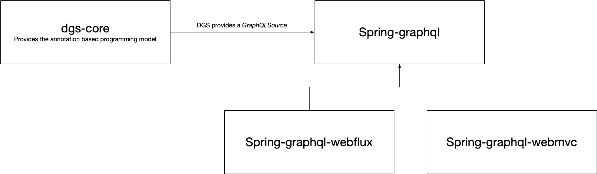

Prototyping spring-graphql integration
====

This is a prototype of integrating DGS with the new `spring-graphql` project.
The `spring-graphql` project has set out to offer a common base for GraphQL in Spring.

Why should DGS integrate with spring-graphql
===

The `spring-graphql` user facing API is fairly low-level, and the user mostly uses the `graphql-java` API.
The DGS framework in contrast offers a user-friendly, declarative programming model.
This raises the question: "Why should the DGS framework care about integrating with `spring-graphql`?".

There are two reasons for the DGS framework to build on top of `spring-graphql`.

Integration with the Spring web stack
---

Although the DGS framework has modules for both WebMVC and Webflux, this really isn't the interesting part of the DGS framework.
The interesting part is the declarative model of wiring up data fetchers and other Graphql components with all its conveniences.
Getting the web stack for "free" by using `spring-graphql` would ease maintenance in the future, and hopefully guarantees better integration with other parts of the web stack such as `spring-security`.

Integration with other Spring projects
----

Other Spring projects such as `spring-data` could very well integrate with a GraphQL layer.
This mostly fall out of scope of the DGS framework, but would be of great value to many DGS users.
Having a common GraphQL core available in Spring makes it more likely other Spring projects would build support.
If the DGS framework uses the same core, it would get integration with such projects without additional work.

Right out of the gate there isn't much to gain for DGS users by integrating with `spring-graphql`, because currently the DGS framework is ahead in terms of features.
However, it is likely the right long-term strategy to integrate well with the larger Spring ecosystem in the future.

Technical design
====

`spring-graphql` defines an interface `GrqphQLSource`.
A `GraphQLSource` provides a `GraphQLSchema` and `GraphQL` instances, which are both types from `graphql-java`.
The `spring-graphql` project comes with a default implementation of this interface that does some basic schema file loading.
The DGS framework provides another implementation of this interface, where the DGS framework is responsible for creating `GraphQLSchema` and `GraphQL` instances.
In a regular DGS, the `DgsSchemaProvider` creates a `GraphQLSchema` based on the registered components and schema files; this is where the declarative programming model comes from.
The `DgsQueryExecutor` creates a `GraphQL` instance based on the (cached) `GraphQLSchema`.

By making the DGS framework implement the `GraphQLSource` interface, the DGS framework becomes responsible for finding components such as data fetchers, loading schema files, and wire it all together.
`Spring-graphql` does the actual query execution.
By using this integration, we get the declarative programming model of the DGS framework, with the execution engine from `spring-graphql`.
More importantly, we can use the `spring-graphql-webmvc` and `spring-graphql-webflux` modules to take care of the web stack, basically making the web components of the DGS framework obsolete.
This is great, because the web components of the framework are really not the interesting part.

Migration path
====

A big concern for the DGS framework is continuity for users.
There should be very limited, if any, code changes required for users to adopt the new stack.

With the approach demonstrated in the prototype, the migration path looks very good.
First, the `spring-graphql` integration is an extra module.
We would probably provide a new starter that's based on the `spring-graphql` stack.
This starter would use the new integration module, and swap out the webmvc/webflux modules to the ones provided by `spring-graphql`.
This makes it an opt-in model, where we can keep the exising DGS stack available while providing the new model as an option.

Over time, we might deprecate the components not based on `spring-graphql`.
This also eliminates concerns around the minimum Spring Boot version to use, which is especially a concern for our usage at Netflix.

Some required changes
====

1. Currently `spring-graphql` serves GraphiQL on `/graphql`. The DGS framework has always used a separate url for this, `/graphiql`, and we would like to keep this at least as an option for continuity.
2. `spring-graphql` assumes an instance of `GraphQLContext`, which is a non-extendable type in `graphql-java`. The DGS framework provides a `DgsContext` instead, which users rely on. 
We will either have to make `GraphQLContext` extendable in `graphql-java`, so that `DgsContext` can implement/extend it, or we need a better abstraction. This is an important requirement to avoid breaking a lot of user code.
3. Some features like file uploads are missing from the `spring-graphql` web components. 
